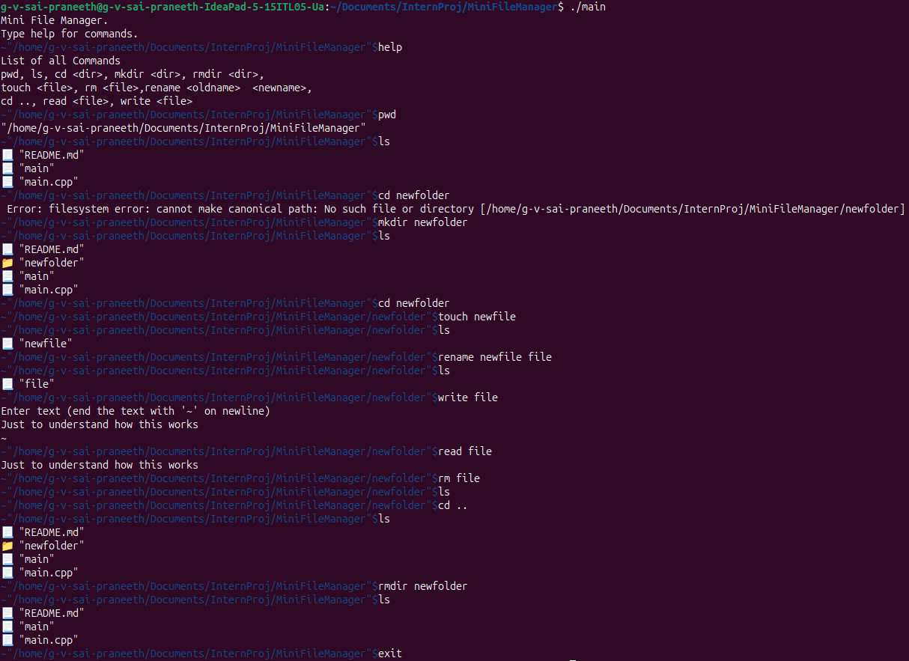

# 📁 MiniFileManager

A C++ project which attempts to mimic a basic file manager.

---

## ✨ Features

This project demonstrates the following:

- 🧭 Able to navigate through commands like `cd`, `ls`, etc.  
- 🛠️ Can manipulate files and folders using `mkdir`, `rmdir`, `rename`, and so on  
- 👨‍💻 Usage of core concepts of OOPS like **Encapsulation** and **Inheritance**  
- 💻 Can be run in a Bash/Terminal environment  

---

## 🚀 Future Plan

- ➕ Add more features like `copy`, `move`  
- 🧬 Use other core OOPS concepts like **Polymorphism**

---

## 🛠️ Compile & Run

Download the `main.cpp` file and run:

```bash
g++ main.cpp -o main
./main 
```

---

## 📊 Sample Output Format

- 